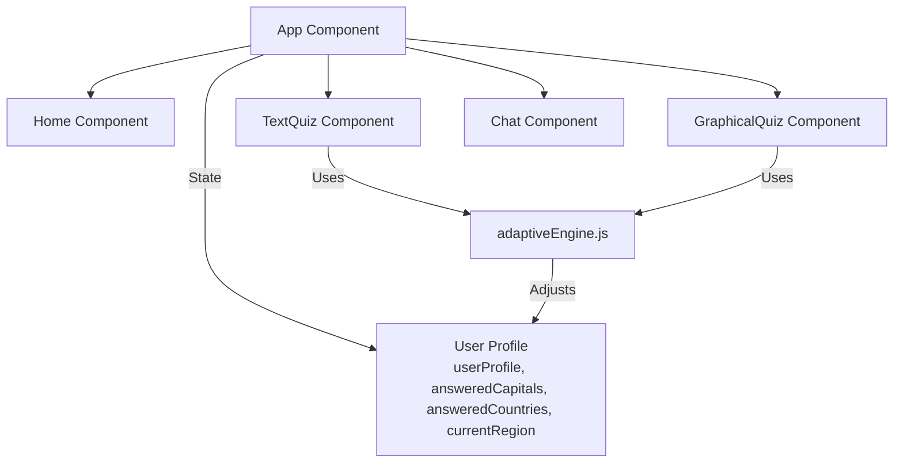

# GeoBuddy ITS 

## Component architecture and state management

GeoBuddy has a main app component that holds the state for the learner model. When learners take quizzes in the TextQuiz and the GraphicalQuiz component, the learner model is updated by functions from the adaptive engine which changes the state of teh app component.





## Learner model (state management)

The learner model is represented by the State variable `userProfile` alongside with the variables `answeredCapitals` and `answeredCountries`.

When the app is loaded, the learner model is initialized by a function provided from the adaptiveEngine.

```js
// Function to initialize a user profile for each region
export const generateInitialUserProfile = (regions) => {
    const initialProfile = {};
    Object.values(regions).forEach(region => {
        initialProfile[region] = { correct: 0, incorrect: 0, points: 0, difficulty: 'easy' };
    });
    return initialProfile;
};
```

The initial learner model then looks like this:

```js
const userProfile = {
    Europe: { correct: 0, incorrect: 0, points: 0, difficulty: 'easy' },
    Africa: { correct: 0, incorrect: 0, points: 0, difficulty: 'easy' },
    Asia: { correct: 0, incorrect: 0, points: 0, difficulty: 'easy' },
    Americas: { correct: 0, incorrect: 0, points: 0, difficulty: 'easy' }
};

const answeredCapitals = [];       // Stores correctly answered capitals
const answeredCountries = [];      // Stores correctly answered countries in graphical quiz
```

The adaptive engine then constantly updates the learner model by providing functions to change the state of the app. After a while, the learner model could look like this for example: 

```js
const userProfile = {
    Europe: { correct: 7, incorrect: 2, points: 17, difficulty: 'hard' },
    Africa: { correct: 3, incorrect: 1, points: 5, difficulty: 'medium' },
    Asia: { correct: 1, incorrect: 3, points: 2, difficulty: 'easy' },
    Americas: { correct: 5, incorrect: 0, points: 10, difficulty: 'medium' }
};

const answeredCapitals = [
    "Paris",       // Europe
    "Berlin",      // Europe
    "Madrid",      // Europe
    "Nairobi",     // Africa
    "Cairo",       // Africa
    "Buenos Aires" // Americas
];

const answeredCountries = [
    "France",      // Europe
    "Germany",     // Europe
    "Kenya",       // Africa
    "Argentina"    // Americas
];
```

## Tutor model (adaptive engine)

The tutor model is represented by the adaptive engine code. The adaptive engine provides functions for changing the state (learner model) and thus changing the UI of the app. The adaptive engine also decides on the way questions are generated based on the user profile state (learner model).

## Domain model

The domain model is represented by the OpenAI API providing access to the GPT-3 model that generates the questions for the app. The prompt design is done by the adaptive engine.